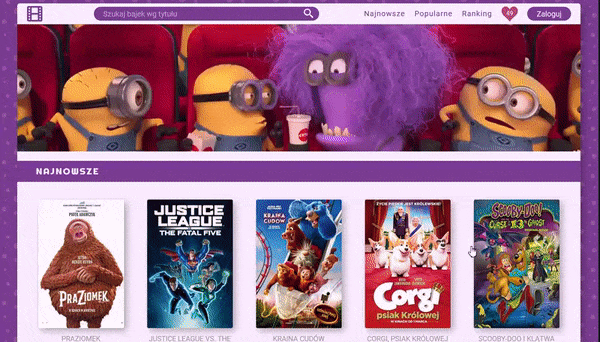

## Animation movies database

> Website that allows users to search animated movies and get details from the TMDb movies database.

> Right now support only polish language.

> This is my Learn to Code project.

## Demo

**[Online](https://baza-bajek.herokuapp.com/)**

## TODO List

- [x] bookmark searches in browser
- [ ] popular movies in search bar appears
- [ ] top movies
- [ ] make website responsive
- [ ] create login system
- [ ] create user DB
- [ ] user should be able to create accounts
- [ ] create favourites movies function
  - allow user to store their fav movies in their acc
- [ ] add additional languages to site

## Technologies and tools used

* TMDb API
* HTML5
* CSS3
* BEM
* JSON
* EJS
* JavaScript
* Node.js
* Express

## License

**[MIT license](http://opensource.org/licenses/mit-license.php)**

